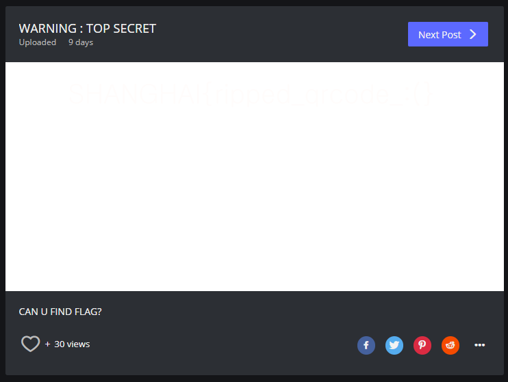

trust와 stealth선배들이 수학여행을 갔을때 열린 ctf
===================================================

# 췍췍 MC조정훈입니다. - 10000
`
SHANGHAI{잘다녀올게얘들아}
`  


# Encode our life - 75  
>Ascii85로 ;b02L7n>p;HVR@9?T'_n/hT15I/ 을 디코딩해준다.

  
  
`  
SHANGHAI{NOT_64...:(}
`  


# TOP SECRET - 125
>pptx를 받아서 열어보면  
>QRcode가 두개로 찢겨져서 숨겨져있다.  
>둘을 적당히 조합해서 코드를 찍으면?  
   
  
 
<hr>
  
<hr>  
  
### 사이트로 이동 (https://m.imgur.com/a/???)  
>하얀배경을 확대시켜보면 안에 플래그가있다.  
  
`  
SHANGHAI{ripped_qrcode_:(}
`  

# TRUSEALTH - 150
>TRUST는 0으로 STEALTH는 1로 바꿔서 문자열로 변환시키면 플래그가 나온다.  

  

   
  
`  
SHANGHAI{string_to_binary_to_trustealth}
`    
  
# zip1337
>압축파일을 1337번 해제하면 플래그가 나온다.  
>딱봐도 매크로 짜는 문제인거같아서 파이썬으로 코드를 만들었다.  
>안전하게 2에서 멈추고 2번정도는 수동으로 했다.

```   
import zipfile  


zip = zipfile.ZipFile('C:\\???\\flag1337.zip')  
zip.extractall('C:\\???\\flag1337')  
c=1336  
while True:  
    a = 'C:\\???\\flag' + str(c) + '.zip'  
    print(a)  
    zip = zipfile.ZipFile(a)  
    zip.extractall('C:\\???\\flag1337')  
    c = c - 1  
    if c == 2:  
        break  

zip.close()  
```    

`SHANGHAI{zipped_flag_so_many_times}`  


# Go High  - 225
>의도한 건지는 모르겠는데 다운받은 파일(폴더)명이 그냥 플래그임  
   
  
`SHANGHAI{QRCODE!!}`  

# New_LOB - 100
>xshell로 stealth서버 접속후  
>'python'으로 파이썬 실행  
>p.send()와 p.recvline(), 마지막으로 p.interactive()만 사용하면 풀 수 있는문제  
```  
from pwn import*
p = remote('???.???.??', ????)  
a = p.recvline()
#주소값 받아와서
#매번 바뀌는 ret주소로 크기는 256바이트로 해서 LOB1번 풀듯이 풀어준후
p.sendline(pay)
#페이로드 보낸다음
p.interactive()
#상호작용 하고
ls
cat flag
#이것들로 끝
```  
`SHANGHAI{YOU_KNOW_LOB!!!!}`  

# Endgame - 225  
귀찮아서 다음에 다시...  
  
# So_Easy... - 50  
귀찮아서 다음에 다시...  
  
# ALL? - 150  
귀찮아서 다음에 다시...

